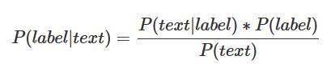
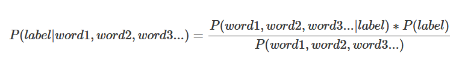
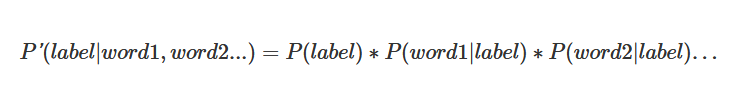

# Machine Learning Engineer Nanodegree
## Capstone Project
Siddheshwar Kumar  
April 28th, 2018

## I. Definition
_(approx. 1-2 pages)_

### Project Overview
Sentiment analysis is one of the most interesting application of Natual Language Processing. It's used to figure out 
if a text, sentence or paragraph expresses negative, positive or neutral emotional feeling.

Social platforms like Twitter, Facebook etc have openions expressed about different products and services. These openions 
are trove of information for companies which want to improved their product, services, marketting strategies. This is where sentimennt
analysis can help. It can tell in general what people think about your product i.e. they like it or dislike it. 

Let take example of review of a movie:
* "Quite boring movie"  - Expressed negative sentiment
* "Incredible moview, really like it" - Expressed positive sentiment

I got motivated about this problem as in the past I have done some very primitive work around sentiment analysis 
on Tweeter feeds.

--
In this section, look to provide a high-level overview of the project in layman’s terms. Questions to ask yourself when writing this section:
- _Has an overview of the project been provided, such as the problem domain, project origin, and related datasets or input data?_
- _Has enough background information been given so that an uninformed reader would understand the problem domain and following problem statement?_

### Problem Statement
In this project, I have performed sentiment analysis using machine learning techniques on IMDB dataset. This dataset is from an old Kaggle competition, **Bag of Words Meets Bags of Popcorn (https://www.kaggle.com/c/word2vec-nlp-tutorial)**.

The goal is to predict whether a movie review is negative or positive given only the text.

For this problem, I am planning to apply Naive Bayes first to create a benchmark. Naive Bayes works quite well in text classifcation problems. And, then plan to use the accuracy obtained in the Naive Bayes as a baseline and improve it further using Deep Learning Technique. Recurrent Neural Networks are often used to deal with texts; so I will be using RNN technique as a final recommened approach. 

--
In this section, you will want to clearly define the problem that you are trying to solve, including the strategy (outline of tasks) you will use to achieve the desired solution. You should also thoroughly discuss what the intended solution will be for this problem. Questions to ask yourself when writing this section:
- _Is the problem statement clearly defined? Will the reader understand what you are expecting to solve?_
- _Have you thoroughly discussed how you will attempt to solve the problem?_
- _Is an anticipated solution clearly defined? Will the reader understand what results you are looking for?_

### Metrics
For Naive Baiyes approach, I have used Compute Receiver operating characteristic (ROC) method. This method is suitable for the binary classification problem which is the case here. The ROC curve is a graphical plot that illustrates the performance of any binary classifier system as its discrimination threshold is varied. To understand ROC curve, https://www.quora.com/Whats-ROC-curve.

And for LSTM technique, I have used 

---
In this section, you will need to clearly define the metrics or calculations you will use to measure performance of a model or result in your project. These calculations and metrics should be justified based on the characteristics of the problem and problem domain. Questions to ask yourself when writing this section:
- _Are the metrics you’ve chosen to measure the performance of your models clearly discussed and defined?_
- _Have you provided reasonable justification for the metrics chosen based on the problem and solution?_

## II. Analysis
_(approx. 2-4 pages)_

### Data Exploration
This dataset contains 25,000 labeled training reviews, 50,000 unlabeled training reviews, and 25,000 testing reviews. Unlabeled training data and testing data doesn't have a sentiment field; only labeled training data has sentiment field. So, to solve the problem, i have used only labelled training data so that the implementation can get trained as well as tested. 

The file (labeledTrainData.tsv) is tab-delimited and has a header row followed by 25,000 rows and contains three columns/fields:

['id' 'sentiment' 'review']
*id*: Unique identifier for each entry in the dataset; we don't need this field for modeling.
*sentiment*: Contains binary values (1 and 0). 1 for positive and 0 for negative. This is the label of the model.
*review*: a Detailed review of movies. This is the text or feature on which machine learning models will get trained.

I have used 20% of data for testing and will report the accuracy of the model on this randomly selected dataset.
Distribution is Dataset is balanced (i.e. both positive and negative are 50% each).

---
In this section, you will be expected to analyze the data you are using for the problem. This data can either be in the form of a dataset (or datasets), input data (or input files), or even an environment. The type of data should be thoroughly described and, if possible, have basic statistics and information presented (such as discussion of input features or defining characteristics about the input or environment). Any abnormalities or interesting qualities about the data that may need to be addressed have been identified (such as features that need to be transformed or the possibility of outliers). Questions to ask yourself when writing this section:
- _If a dataset is present for this problem, have you thoroughly discussed certain features about the dataset? Has a data sample been provided to the reader?_
- _If a dataset is present for this problem, are statistics about the dataset calculated and reported? Have any relevant results from this calculation been discussed?_
- _If a dataset is **not** present for this problem, has discussion been made about the input space or input data for your problem?_
- _Are there any abnormalities or characteristics about the input space or dataset that need to be addressed? (categorical variables, missing values, outliers, etc.)_

### Exploratory Visualization
In this section, you will need to provide some form of visualization that summarizes or extracts a relevant characteristic or feature about the data. The visualization should adequately support the data being used. Discuss why this visualization was chosen and how it is relevant. Questions to ask yourself when writing this section:
- _Have you visualized a relevant characteristic or feature about the dataset or input data?_
- _Is the visualization thoroughly analyzed and discussed?_
- _If a plot is provided, are the axes, title, and datum clearly defined?_

### Algorithms and Techniques
For this text classification problem, I have used below two approaches:

#### Naive Bayes Classifier:
One particular feature of Naive Bayes is that it’s a good algorithm for working with text classification. The relative simplicity of the algorithm and the independent features assumption of Naive Bayes make it a strong performer for classifying texts.The Naive Bayes classifier uses the Bayes Theorem to select the outcome with the highest probability. This classifier assumes the features(in this case the words) are independent and hence the word naive.

The Naive Bayes classifier for this problem says that the probability of the label (positive or negative) for the given review text is equal to the probability of the text given the label, times the probability a label occurs, everything divided by the probability that this text is found.

Text in our case is collection of words. So above equation can be expressed as:

We want to compare the probabilities of the labels and choose the one with higher probability. The denominator, i.e. the term P(word1, word2, word3…) is equal for everything, so we can ignore it. Also, as discussed above there is no dependence between words in the text (not possible always as few words mostly appear together but we can ignore such abberations); so equation can be re-written as:

P(label=positive) is the fraction of the training set that is a positive text;
P(word1|label=negative) is the number of times the word1 appears in a negative text divided by the number of times the word1 appears in every text.

#### Recurrent Neural Netowrk/Long Short-Term Memory (RNN/LSTM):
Traditional neural networks don't give preference to some information which arrived say some time back or few words before. Recurrent neural networks address this issue. They are networks with loops in them, allowing information to persist. A recurrent neural network can be thought of as multiple copies of the same network, each passing a message to a successor. Consider what happens if we unroll the loop. Below is image from famous colah blog (http://colah.github.io/posts/2015-08-Understanding-LSTMs/).

Recursive neural network proved to be efficient in constructing sentence representations. The model has tree structure, which is able to capture semantic of sentence. RNN suffer from vanishing gradients problem, and makes it difficult to learn long-distance correlation in sequence. LSTM are a type of RNN.

### Benchmark
In this section, you will need to provide a clearly defined benchmark result or threshold for comparing across performances obtained by your solution. The reasoning behind the benchmark (in the case where it is not an established result) should be discussed. Questions to ask yourself when writing this section:
- _Has some result or value been provided that acts as a benchmark for measuring performance?_
- _Is it clear how this result or value was obtained (whether by data or by hypothesis)?_

## III. Methodology
_(approx. 3-5 pages)_

### Data Preprocessing
Text contain lot of noise or un-important content. In current problem as well, not all features will be equally important. I have used below techniques to preprocess the dataset. 

#### Remove special chars
Punctuation, numbers and special characters are not going to add any value in sentiment analysis, so will remove all such characters. Also, the data is generated from an online platform so it might have some HTML tags as well; will get rid of them as well. 

#### Remove stop words
Words like and, the, it etc known as *Stop Words* also don't carry any meaningful information so; will remove all stop words from the reviews. Plan to use Python's **NLTK** library to get list of English Stop words. 

#### Stemmerize 
Not all unique words are different. Take example of love and loves; both are same but if treated differently it will un-necessarily increase the vocab. 

---
Also convert all chars to lower case.
In this section, all of your preprocessing steps will need to be clearly documented, if any were necessary. From the previous section, any of the abnormalities or characteristics that you identified about the dataset will be addressed and corrected here. Questions to ask yourself when writing this section:
- _If the algorithms chosen require preprocessing steps like feature selection or feature transformations, have they been properly documented?_
- _Based on the **Data Exploration** section, if there were abnormalities or characteristics that needed to be addressed, have they been properly corrected?_
- _If no preprocessing is needed, has it been made clear why?_

### Implementation
https://www.dataquest.io/blog/naive-bayes-tutorial/

In this section, the process for which metrics, algorithms, and techniques that you implemented for the given data will need to be clearly documented. It should be abundantly clear how the implementation was carried out, and discussion should be made regarding any complications that occurred during this process. Questions to ask yourself when writing this section:
- _Is it made clear how the algorithms and techniques were implemented with the given datasets or input data?_
- _Were there any complications with the original metrics or techniques that required changing prior to acquiring a solution?_
- _Was there any part of the coding process (e.g., writing complicated functions) that should be documented?_

### Refinement
In this section, you will need to discuss the process of improvement you made upon the algorithms and techniques you used in your implementation. For example, adjusting parameters for certain models to acquire improved solutions would fall under the refinement category. Your initial and final solutions should be reported, as well as any significant intermediate results as necessary. Questions to ask yourself when writing this section:
- _Has an initial solution been found and clearly reported?_
- _Is the process of improvement clearly documented, such as what techniques were used?_
- _Are intermediate and final solutions clearly reported as the process is improved?_

## IV. Results
_(approx. 2-3 pages)_

### Model Evaluation and Validation
In this section, the final model and any supporting qualities should be evaluated in detail. It should be clear how the final model was derived and why this model was chosen. In addition, some type of analysis should be used to validate the robustness of this model and its solution, such as manipulating the input data or environment to see how the model’s solution is affected (this is called sensitivity analysis). Questions to ask yourself when writing this section:
- _Is the final model reasonable and aligning with solution expectations? Are the final parameters of the model appropriate?_
- _Has the final model been tested with various inputs to evaluate whether the model generalizes well to unseen data?_
- _Is the model robust enough for the problem? Do small perturbations (changes) in training data or the input space greatly affect the results?_
- _Can results found from the model be trusted?_

### Justification
In this section, your model’s final solution and its results should be compared to the benchmark you established earlier in the project using some type of statistical analysis. You should also justify whether these results and the solution are significant enough to have solved the problem posed in the project. Questions to ask yourself when writing this section:
- _Are the final results found stronger than the benchmark result reported earlier?_
- _Have you thoroughly analyzed and discussed the final solution?_
- _Is the final solution significant enough to have solved the problem?_

## V. Conclusion
_(approx. 1-2 pages)_

### Free-Form Visualization
In this section, you will need to provide some form of visualization that emphasizes an important quality about the project. It is much more free-form, but should reasonably support a significant result or characteristic about the problem that you want to discuss. Questions to ask yourself when writing this section:
- _Have you visualized a relevant or important quality about the problem, dataset, input data, or results?_
- _Is the visualization thoroughly analyzed and discussed?_
- _If a plot is provided, are the axes, title, and datum clearly defined?_

### Reflection
In this section, you will summarize the entire end-to-end problem solution and discuss one or two particular aspects of the project you found interesting or difficult. You are expected to reflect on the project as a whole to show that you have a firm understanding of the entire process employed in your work. Questions to ask yourself when writing this section:
- _Have you thoroughly summarized the entire process you used for this project?_
- _Were there any interesting aspects of the project?_
- _Were there any difficult aspects of the project?_
- _Does the final model and solution fit your expectations for the problem, and should it be used in a general setting to solve these types of problems?_

### Improvement
In this section, you will need to provide discussion as to how one aspect of the implementation you designed could be improved. As an example, consider ways your implementation can be made more general, and what would need to be modified. You do not need to make this improvement, but the potential solutions resulting from these changes are considered and compared/contrasted to your current solution. Questions to ask yourself when writing this section:
- _Are there further improvements that could be made on the algorithms or techniques you used in this project?_
- _Were there algorithms or techniques you researched that you did not know how to implement, but would consider using if you knew how?_
- _If you used your final solution as the new benchmark, do you think an even better solution exists?_

-----------

**Before submitting, ask yourself. . .**

- Does the project report you’ve written follow a well-organized structure similar to that of the project template?
- Is each section (particularly **Analysis** and **Methodology**) written in a clear, concise and specific fashion? Are there any ambiguous terms or phrases that need clarification?
- Would the intended audience of your project be able to understand your analysis, methods, and results?
- Have you properly proof-read your project report to assure there are minimal grammatical and spelling mistakes?
- Are all the resources used for this project correctly cited and referenced?
- Is the code that implements your solution easily readable and properly commented?
- Does the code execute without error and produce results similar to those reported?
